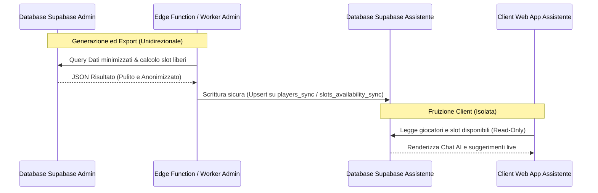

# Contratto di Sincronizzazione Dati: Admin <-> Assistente Giocatori

Questo documento definisce il contratto formale per lo scambio di dati e la sincronizzazione tra l'applicazione gestionale di cabina di regia (`Padel Match Organizer / Admin`) e la web app pubblica per i giocatori (`Socio Player Chat AI / Assistente`).

Il principio cardine è la **netta separazione e isolamento dei sistemi** per garantire sicurezza, privacy dei dati personali ed evitare qualsiasi forma di accoppiamento diretto o dipendenza a livello di database.

---

## 1. Architettura e Isolamento Tecnico

Per garantire la massima sicurezza e adempiere alle policy di separazione degli ambienti:

* **Repository Git Separati**:
  * **Admin**: `PadelVillage/padel-match-organizer`
  * **Assistente**: `PadelVillage/padel-match-assistant`
* **Ambienti Supabase Indipendenti**:
  * L'Assistente non possiede né richiede l'accesso alle tabelle dell'Admin.
  * **Admin TEST**: `cudiqnrrlbyqryrtaprd` | **Admin PROD**: `qqbfphyslczzkxoncgex`
  * **Assistente TEST**: `aylykijfirtegyxzdwgu` | **Assistente PROD**: (da creare)
* **Nessun Accesso Diretto Client-Side**:
  * L'app client dell'Assistente interagisce esclusivamente con le API e il database dell'Assistente.
  * Il transito e l'aggiornamento dei dati dall'Admin all'Assistente avviene unicamente tramite l'interscambio di **snapshot JSON minimizzati**, gestiti tramite routine server-side sicure (Edge Functions o scheduler dedicati).

---

## 2. Requisiti di Sicurezza e Privacy

> [!IMPORTANT]
> **Divieto Assoluto di Esposizione Dati Personali Sensibili**
> I numeri di telefono e gli indirizzi email reali dei soci non devono **MAI** essere sincronizzati o conservati all'interno dell'ambiente Supabase dell'Assistente né inclusi negli snapshot di sincronizzazione. 

* **Oscuramento del Telefono**: I numeri di telefono reali vengono sostituiti da token di sessione cifrati a scadenza o non inclusi del tutto nel flusso di matching.
* **Tokenizzazione Sessioni**: L'accesso dei giocatori all'Assistente è governato da token di autenticazione univoci memorizzati nell'URL (es. `?t=TOKEN_SICURO`), generati dall'Admin ed esportati in modo da non rendere visibili i dati anagrafici originari.
* **Accesso Read-Only**: La sincronizzazione dei dati anagrafici e delle disponibilità slot è unidirezionale dall'Admin all'Assistente.

---

## 3. Schemi di Interscambio JSON (Contratto Dati)

Il flusso di sincronizzazione prevede l'esportazione dall'Admin di due dataset principali in formato JSON, da caricare rispettivamente nelle tabelle `players_sync` e `slots_availability_sync` dell'ambiente Supabase dell'Assistente.

### Schema 3.1: `players_sync` (Anagrafica Giocatori Minimizzata)

Questo snapshot contiene l'elenco dei soli soci attivi che hanno espresso il consenso all'utilizzo dell'Assistente. Tutte le informazioni personali superflue (note interne, storico prenotazioni grezzo, email reali, dati finanziari reali) sono escluse.

#### Struttura Campi JSON (`players_sync`)

| Campo | Tipo | Nullable | Descrizione | Vincolo / Regola di Validazione |
|---|---|---|---|---|
| `id` | `VARCHAR(50)` | No | ID tecnico univoco del socio derivato dal gestionale Admin. | Es: `"PMO-000948"`. Deve essere unico. |
| `full_name` | `VARCHAR(100)` | No | Nome e cognome sanitizzati del socio per la visualizzazione. | Es: `"Maurizio Aprea"`. |
| `level` | `DECIMAL(2,1)` | No | Livello di gioco ufficiale validato (range `0.5` - `5.5`). | Es: `3.5`. Solo valori con passo `0.5`. |
| `sex` | `CHAR(1)` | No | Sesso del giocatore per i match di divisione. | Valori ammessi: `'M'`, `'F'`. |
| `active` | `BOOLEAN` | No | Flag di stato operativo e abilitazione del socio. | Deve essere `true` per partecipare al matching. |
| `auth_token` | `VARCHAR(255)` | Sì | Token temporaneo e sicuro per l'accesso diretto via URL. | Cifrato o generato in modo casuale dall'Admin. |

#### Esempio di Payload JSON (`players_sync`)

```json
[
  {
    "id": "PMO-000948",
    "full_name": "Maurizio Aprea",
    "level": 3.5,
    "sex": "M",
    "active": true,
    "auth_token": "a1b2c3d4e5f6g7h8i9j0"
  },
  {
    "id": "PMO-000210",
    "full_name": "Francesca Rossi",
    "level": 2.5,
    "sex": "F",
    "active": true,
    "auth_token": "z9y8x7w6v5u4t3s2r1q0"
  }
]
```

---

### Schema 3.2: `slots_availability_sync` (Calendario e Disponibilità Campi)

Questo dataset rappresenta l'aggregazione degli slot liberi calcolati in modo dinamico dall'Admin (deducendo le prenotazioni esistenti, le manutenzioni e le chiusure campo). L'Assistente lo utilizza per mostrare al giocatore gli orari reali in cui è possibile organizzare o completare partite.

#### Struttura Campi JSON (`slots_availability_sync`)

| Campo | Tipo | Nullable | Descrizione | Formato / Valori ammessi |
|---|---|---|---|---|
| `date` | `DATE` | No | Data dello slot di gioco. | ISO 8601: `YYYY-MM-DD`. |
| `time` | `TIME` | No | Orario di inizio dello slot di gioco. | Formato 24h: `HH:MM`. |
| `courts_available` | `INTEGER` | No | Numero di campi liberi e prenotabili per lo slot specifico. | Min: `0`, Max: `courts_total`. |
| `courts_total` | `INTEGER` | No | Numero totale di campi gestiti dal circolo per quello slot. | Es: `4` (Campo 1, 2, 3, 4). |

#### Esempio di Payload JSON (`slots_availability_sync`)

```json
[
  {
    "date": "2026-05-22",
    "time": "18:30",
    "courts_available": 2,
    "courts_total": 4
  },
  {
    "date": "2026-05-22",
    "time": "20:00",
    "courts_available": 1,
    "courts_total": 4
  },
  {
    "date": "2026-05-23",
    "time": "09:00",
    "courts_available": 4,
    "courts_total": 4
  }
]
```

---

## 4. Meccanica e Pipeline di Sincronizzazione

Il flusso di transito dei dati garantisce l'assenza di accessi asincroni disordinati:



### Regole operative della pipeline:
1. **Frequenza di aggiornamento**: Lo snapshot viene rigenerato e caricato dall'Admin a intervalli regolari (es. ogni 15 minuti) oppure in concomitanza con eventi critici del gestionale (es. chiusura di una prenotazione Matchpoint o aggiornamento del livello di un giocatore).
2. **Upsert Determinista**: Il caricamento nell'ambiente Assistente avviene tramite operazioni di `UPSERT` basate sulla chiave primaria (`id` per i giocatori, e la coppia `date` + `time` per gli slot), garantendo consistenza atomica e prevenendo record duplicati o orfani.
3. **Gestione del Consenso (Opt-Out)**: Se un socio revoca il consenso per l'Assistente dall'Admin, il flag `active` viene impostato a `false` nello snapshot successivo, disattivandone l'operatività lato Assistente senza necessità di cancellare fisicamente i dati storici delle partite completate.
